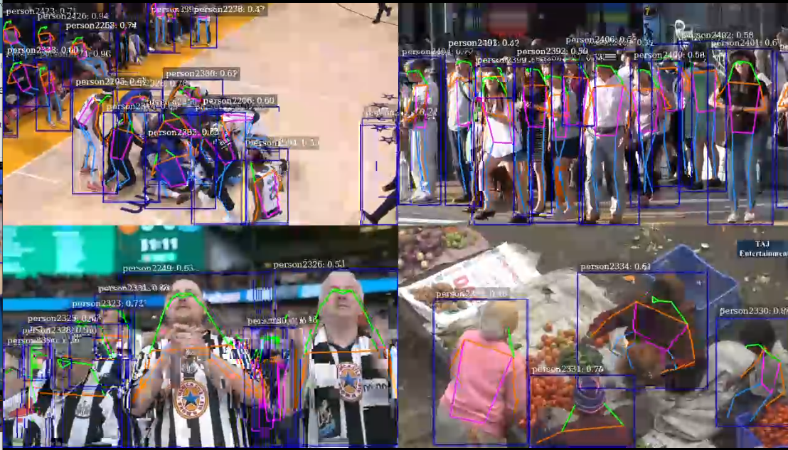
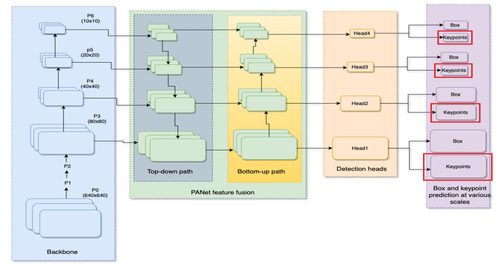
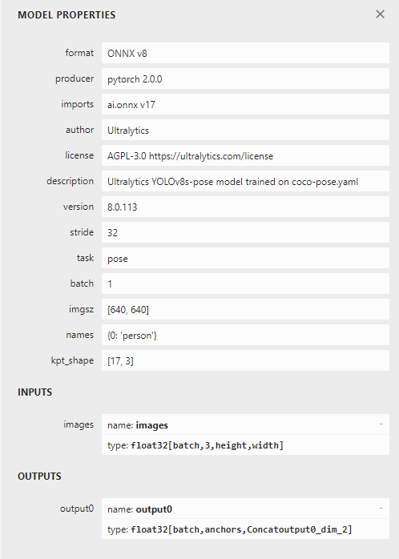

# Deepstream-YOLO-Pose


 

<div style="text-align: center;">
    <figure>
          
          <figcaption> <br> YOLO-Pose accelerated with TensorRT and multi-streaming with Deepstream SDK </figcaption>
    </figure>
</div>

---
[](https://github.com/triple-Mu/YOLOv8-TensorRT)
[](https://github.com/triple-Mu/YOLOv8-TensorRT)
[](https://developer.nvidia.com/tensorrt)
---


## System Requirements
- Python 3.8
  - Should be already installed with Ubuntu 20.04
- Ubuntu 20.04 
- CUDA 11.4 (Jetson)
- TensorRT 8+

#### DeepStream 6.2 on x86 platform

* [Ubuntu 20.04](https://releases.ubuntu.com/20.04/)
* [CUDA 11.8](https://developer.nvidia.com/cuda-11-8-0-download-archive?target_os=Linux&target_arch=x86_64&Distribution=Ubuntu&target_version=20.04&target_type=runfile_local)
* [TensorRT 8.5 GA Update 1 (8.5.2.2)](https://developer.nvidia.com/nvidia-tensorrt-8x-download)
* [NVIDIA Driver 525.85.12 (Data center / Tesla series) / 525.105.17 (TITAN, GeForce RTX / GTX series and RTX / Quadro series)](https://www.nvidia.com.br/Download/index.aspx)
* [NVIDIA DeepStream SDK 6.2](https://developer.nvidia.com/deepstream-getting-started)
* [GStreamer 1.16.3](https://gstreamer.freedesktop.org/)
* [(DeepStream-Yolo)](https://github.com/marcoslucianops/DeepStream-Yolo)
  
#### DeepStream 6.2 on Jetson platform
- [JetPack 5.1.1 / 5.1](https://developer.nvidia.com/embedded/jetpack)
- [NVIDIA DeepStream SDK 6.2](https://developer.nvidia.com/deepstream-sdk)
  - Download and install from https://developer.nvidia.com/deepstream-download
- [(DeepStream-Yolo)](https://github.com/marcoslucianops/DeepStream-Yolo)


### Deepstream Python Biding
- [Deepstream Python Biding](https://github.com/NVIDIA-AI-IOT/deepstream_python_apps/tree/master/bindings)

### Gst-python and GstRtspServer

- Installing GstRtspServer and introspection typelib
 
    ```
    sudo apt update
    sudo apt install python3-gi python3-dev python3-gst-1.0 -y
    sudo apt-get install libgstrtspserver-1.0-0 gstreamer1.0-rtsp
    ```
    For gst-rtsp-server (and other GStreamer stuff) to be accessible in
    Python through gi.require_version(), it needs to be built with
    gobject-introspection enabled (libgstrtspserver-1.0-0 is already).
    Yet, we need to install the introspection typelib package:
    ```
    sudo apt-get install libgirepository1.0-dev
    sudo apt-get install gobject-introspection gir1.2-gst-rtsp-server-1.0
    ```
## Prepare YOLO-Pose Model

  <div style="text-align: center;">
    <figure>
          
          <figcaption> <br>YOLO-pose architecture <br> </figcaption>
    </figure>
  </div>

  source : [YOLO-Pose: Enhancing YOLO for Multi Person Pose Estimation Using Object Keypoint Similarity Loss](https://arxiv.org/abs/2204.06806)  

  
- [ ] ~~[YOLOv7](https://github.com/WongKinYiu/yolov7)~~
  - [Gwencong/yolov7-pose-tensorrt](https://github.com/Gwencong/yolov7-pose-tensorrt)
  - [ nanmi/yolov7-pose](https://github.com/nanmi/yolov7-pose)
    - bugs in `/YoloLayer_TRT_v7.0/build/libyolo.so`(The detection box is not synchronized with the screen)
- [x] [YOLOv8](https://github.com/ultralytics/ultralytics)


### Prepare [YOLOv8](https://github.com/ultralytics/ultralytics) TensorRT Engine
  - Choose yolov8-pose for better operator optimization of ONNX model
  - Base on [triple-Mu/YOLOv8-TensorRT/Pose.md](https://github.com/triple-Mu/YOLOv8-TensorRT/blob/main/docs/Pose.md)

 
- The yolov8-pose model conversion route is : YOLOv8 PyTorch model -> ONNX -> TensorRT Engine

  ***Notice !!!*** This repository don't support TensorRT API building !!!

#### Get `yolov8s-pose.pt`

https://github.com/ultralytics/ultralytics

</details>

<details><summary>Benchmark of YOLOv8-Pose</summary>

See [Pose Docs](https://docs.ultralytics.com/tasks/pose) for usage examples with these models.

| Model                                                                                                | size<br><sup>(pixels) | mAP<sup>pose<br>50-95 | mAP<sup>pose<br>50 | Speed<br><sup>CPU ONNX<br>(ms) | Speed<br><sup>A100 TensorRT<br>(ms) | params<br><sup>(M) | FLOPs<br><sup>(B) |
| ---------------------------------------------------------------------------------------------------- | --------------------- | --------------------- | ------------------ | ------------------------------ | ----------------------------------- | ------------------ | ----------------- |
| [YOLOv8n-pose](https://github.com/ultralytics/assets/releases/download/v0.0.0/yolov8n-pose.pt)       | 640                   | 50.4                  | 80.1               | 131.8                          | 1.18                                | 3.3                | 9.2               |
| [YOLOv8s-pose](https://github.com/ultralytics/assets/releases/download/v0.0.0/yolov8s-pose.pt)       | 640                   | 60.0                  | 86.2               | 233.2                          | 1.42                                | 11.6               | 30.2              |
| [YOLOv8m-pose](https://github.com/ultralytics/assets/releases/download/v0.0.0/yolov8m-pose.pt)       | 640                   | 65.0                  | 88.8               | 456.3                          | 2.00                                | 26.4               | 81.0              |
| [YOLOv8l-pose](https://github.com/ultralytics/assets/releases/download/v0.0.0/yolov8l-pose.pt)       | 640                   | 67.6                  | 90.0               | 784.5                          | 2.59                                | 44.4               | 168.6             |
| [YOLOv8x-pose](https://github.com/ultralytics/assets/releases/download/v0.0.0/yolov8x-pose.pt)       | 640                   | 69.2                  | 90.2               | 1607.1                         | 3.73                                | 69.4               | 263.2             |
| [YOLOv8x-pose-p6](https://github.com/ultralytics/assets/releases/download/v0.0.0/yolov8x-pose-p6.pt) | 1280                  | 71.6                  | 91.2               | 4088.7                         | 10.04                               | 99.1               | 1066.4            |

- **mAP<sup>val</sup>** values are for single-model single-scale on [COCO Keypoints val2017](http://cocodataset.org)
  dataset.
  <br>Reproduce by `yolo val pose data=coco-pose.yaml device=0`
- **Speed** averaged over COCO val images using an [Amazon EC2 P4d](https://aws.amazon.com/ec2/instance-types/p4/) instance.
  <br>Reproduce by `yolo val pose data=coco8-pose.yaml batch=1 device=0|cpu`

- Source : [ultralytics](https://github.com/ultralytics/ultralytics)
</details>

```
wget https://github.com/ultralytics/assets/releases/download/v0.0.0/yolov8s-pose.pt
```
#### Pytorch Model to Onnx Model 
- Export Orin ONNX model by ultralytics
  You can leave this repo and use the original `ultralytics` repo for onnx export.
- CLI tools(`yolo` command from "ultralytics.com")
  - Recommended in your server to get faster speed
  - ref : [ultralytics.com/modes/export](https://docs.ultralytics.com/modes/export/#arguments)
  - Usage(after `pip3 install ultralytics`):


  ```shell
  yolo export model=yolov8s-pose.pt format=onnx device=0 \
              imgsz=640 \
              half=true \
              dynamic=true \
              simplify=true
  ```

  After executing the above command, you will get an engine named `yolov8s-pose.onnx` too.

- [Optional] Execute `netron yolov8s-pose.onnx` to view the model architecture
  -  Check Model Ouputs
      - Note that the number of anchors for `YOLOv8-Pose` is  <span style="color:yellow;">56</span> 

        - bbox(4) + confidence(1) + keypoints(3 x 17) = 4 + 1 + 0 + 51 = 56
      - The number of anchors of `YOLOv7-Pose` is <span style="color:yellow;">57</span> 
        - bbox(4) + confidence(1) + cls(1) + keypoints(3 x 17) = 4 + 1 + 1 + 51 = 57
  - Model registration information of YOLOv8S-Pose
    - Tensor shape of `INPUTS` (batch, channel, height, width) and \
      `OUTPUTS` (batch, anchors, max_outpus).

      <div style="text-align: center;">
        <figure>
              
              <figcaption>  </figcaption>
        </figure>
      </div>
    
    - Move your Onnx Model to egdge device in specific path
      - put model on your edge device
        ```shell
        sudo chmod u+rwx -R /opt/nvidia/deepstream/deepstream/samples/models # Add Write and execute permissions 
        sudo mkdir -p tao_pretrained_models/YOLOv8-TensorRT 
        sudo chmod u+rwx -R tao_pretrained_models/YOLOv8-TensorRT 
        mv -v <path_of_your_yolov8-pose_model> /opt/nvidia/deepstream/deepstream/samples/models/tao_pretrained_models/YOLOv8-TensorRT/yolov8s-pose-dy.onnx
        ```


#### Onnx to TensorRT Engine with dynamic_batch
  - Must be bound to a hardware device, please put it on your edge device
  - Specify parameters such as `-minShapes --optShapes --maxShapes` to set dynamic batch processing.
  ```shell
  cd /opt/nvidia/deepstream/deepstream/samples/models/tao_pretrained_models/YOLOv8-TensorRT 
  /usr/src/tensorrt/bin/trtexec --verbose \
      --onnx=yolov8s-pose-dy.onnx \
      --fp16 \
      --workspace=4096 \
      --minShapes=images:1x3x640x640 \
      --optShapes=images:12x3x640x640 \
      --maxShapes=images:16x3x640x640 \
      --saveEngine=yolov8s-pose-dy.engine
  ``` 

#### Test and Check Tensortrt Engine

```
/usr/src/tensorrt/bin/trtexec --loadEngine=yolov8s-pose-dy.engine
``` 
- or test with multi batch for dynamic shaped onnx model
    -  `--shapes=spec` Set input shapes for dynamic shapes inference inputs.
  ```
  /usr/src/tensorrt/bin/trtexec  \
      --loadEngine=yolov8s-pose-dy.engine \
      --shapes=images:12x3x640x640 
  ``` 

- Performance on Jetson(AGX Xavier / AGX Orin)

  | model        |   device    | size | batch | trtexec<br>fps | trtexec<br>ms |
  | ------------ |:-----------:| ---- | ----- |:--------------:|:-------------:|
  | yolov8s-pose | AGX Xavier | 640  | 1     |      40.6      |     24.7      |
  | yolov8s-pose | AGX Xavier | 640  | 12    |      12.1      |     86.4      |
  | yolov8s-pose |  AGX Orin  | 640  | 1     |     258.8      |      4.2      |
  | yolov8s-pose |  AGX Orin  | 640  | 12    |      34.8      |     33.2      |
  


## Basic usage

### Download  Ripository
```shell
cd /opt/nvidia/deepstream/deepstream/sources/deepstream_python_apps 
sudo chmod u+rwx -R apps/ # Add Write and execute permissions for group user
cd apps/
git clone <this ripository>
```


### To run the app with default settings:
------------------------------------------
  - NVInfer with rtsp inputs 
     ```shell
     python3 deepstream_YOLOv8-Pose_rtsp.py \ 
        -i  rtsp://sample_1.mp4 \
            rtsp://sample_2.mp4 \ 
            rtsp://sample_N.mp4  \
     ``` 

   - eg: loop with local file inputs  
      ```shell
      python3 deepstream_YOLOv8-Pose_rtsp.py \
          -i file:///home/ubuntu/video1.mp4 file:///home/ubuntu/video2.mp4 \
          -config dstest1_pgie_YOLOv8-Pose_config.txt \
          --file-loop
      ```
  - Default RTSP streaming location:
    - `rtsp://<server IP>:8554/ds-test`
    - VLC Player on client suggested([Camera Streaming and Multimedia](https://github.com/dusty-nv/jetson-inference/blob/master/docs/aux-streaming.md)) 
   
  Note:
  1) if `-g/--pgie` : uses nvinfer as default. (['nvinfer', 'nvinferserver']).
  2) `-config/--config-file` : need to be provided for custom models.
  3) `--file-loop` : option can be used to loop input files after EOS.
  4) `--conf-thres` : Objec Confidence Threshold
  5) `--iou-thres` : IOU Threshold for NMS


  This sample app is derived from [NVIDIA-AI-IOT/deepstream_python_apps/apps](https://github.com/NVIDIA-AI-IOT/deepstream_python_apps/tree/441b50da01779a2afacc60d40cd666d4bdde628e/apps) and adds customization features

  - Includes following : 

    - [x] Accepts multiple sources 
    - [x] Accepts RTSP stream as input and gives out inference as RTSP stream
    - [x] NVInfer GPU inference engine
    - [ ] NVInferserver  GPU inference engine(Not yet tested)
    - [x] MultiObjectTracker(NVTracker)
    - [x] Automatically adjusts the tensor shape of the loaded input and output (`NvDsInferTensorMeta`) 
    - [x] Extract the stream metadata, imagedata, which contains useful information about the frames in the batched buffer.
        <div style="text-align: center;">
          <figure>
                
                <figcaption>  <br>  </figcaption>
          </figure>
        </div>

      source : [deepstream-imagedata-multistream](https://github.com/NVIDIA-AI-IOT/deepstream_python_apps/tree/master/apps/deepstream-imagedata-multistream)
---
# Reference
- [YOLOv5](https://github.com/ultralytics/yolov5)
- [YOLOv7](https://github.com/WongKinYiu/yolov7)
- [YOLOv8](https://github.com/ultralytics/ultralytics)
- [TexasInstruments/edgeai-yolov5](https://github.com/TexasInstruments/edgeai-yolov5/tree/yolo-pose)
- [triple-Mu/YOLOv8-TensorRT](https://github.com/triple-Mu/YOLOv8-TensorRT/blob/main/docs/Pose.md)
- [marcoslucianops/DeepStream-Yolo](https://github.com/marcoslucianops/DeepStream-Yolo)

- [Gwencong/yolov7-pose-tensorrt](https://github.com/Gwencong/yolov7-pose-tensorrt)
- [ nanmi/yolov7-pose](https://github.com/nanmi/yolov7-pose)